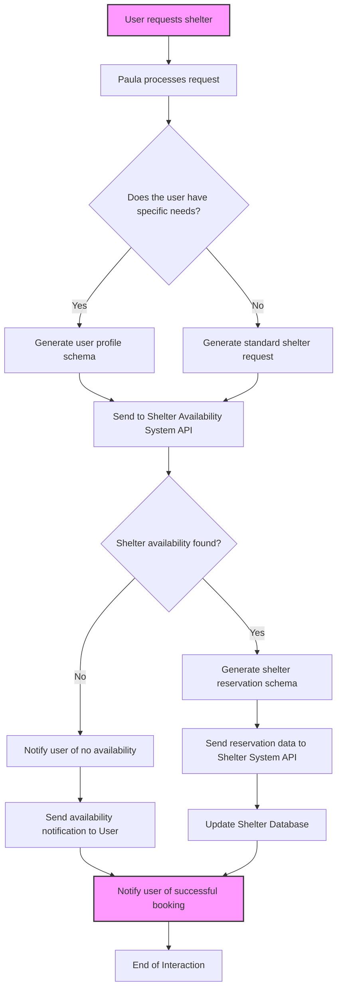

# PonoConnect Schema Contributions

## Overview

This repository provides a set of **JSON schemas** designed to support the **PonoConnect** project, which helps unhoused individuals connect with shelter resources and facilitates advocacy for Housing First initiatives. The schemas ensure **consistent, structured, and deterministic responses**, allowing for seamless integration with webhooks, APIs, and databases.

### Why These Schemas Matter

These schemas enable **PonoConnect** to:
- **Stabilize responses**: By defining a clear data structure, we ensure the system generates consistent outputs, even in high-stress situations.
- **Streamline integration**: The structured data format makes it easy to integrate with traditional systems like **webhooks**, **APIs**, and **databases**, improving communication and efficiency across platforms.
- **Enhance user experience**: By leveraging structured data, **Paula** (the AI assistant) can provide accurate, actionable information to both unhoused individuals and advocates for Housing First shelters.

## Example Schemas

### 1. **User Profile Schema**

The user profile schema captures essential user details, including the number of people needing shelter, special needs, and geographical location.

Example:
```json
{
  "userId": "user12345",
  "numPeople": 4,
  "hasPets": true,
  "gender": "Female",
  "specialNeeds": "Wheelchair accessible room required.",
  "location": {
    "latitude": 21.3081,
    "longitude": -157.8583
  }
}
```

### 2. **Shelter Reservation Schema**

This schema represents a shelter reservation, linking users to available shelters with start and end dates.

Example:
```json
{
  "reservationId": "resv001234",
  "userId": "user12345",
  "shelterId": "shelter5678",
  "reservationDate": "2024-09-18T14:30:00Z",
  "unitType": "Family Units",
  "startDate": "2024-09-18T15:00:00Z",
  "endDate": "2024-09-19T15:00:00Z",
  "confirmationStatus": "Confirmed"
}
```

### 3. **Outreach Resource Schema**

This schema catalogs outreach resources like shelters, food banks, and healthcare services.

Example:
```json
{
  "resourceId": "resource001",
  "name": "Waikiki Health - Keauhou Shelter",
  "contact": {
    "name": "Direct Line",
    "phone": "808-537-8330",
    "email": "contact@waikikihealth.org"
  },
  "resourceType": "Shelter",
  "location": {
    "address": "1234 Keauhou Street, Honolulu, HI 96815",
    "latitude": 21.2775,
    "longitude": -157.8324
  },
  "operatingHours": "Open 24/7"
}
```

### 4. **Housing First Advocacy Schema**

This schema tracks the actions and goals of advocates working to promote Housing First initiatives.

Example:
```json
{
  "advocateId": "advocate567",
  "goal": "Advocate for More Housing First Shelters",
  "actionsTaken": [
    "Met with local council representatives",
    "Organized a community petition"
  ],
  "localChallenges": "Limited funding and resistance to permanent housing solutions.",
  "advocacyGroup": "Housing for All",
  "contactLocalRepresentatives": true,
  "petitionOrganized": true
}
```

### 5. **Shelter Vacancy Listing Schema**

The shelter vacancy listing schema ensures consistent reporting of available shelter units, including conditions and eligibility.

Example:
```json
{
  "lastUpdated": "09/18/2024",
  "shelters": [
    {
      "agency": "Waikiki Health - Keauhou Shelter",
      "contact": {
        "name": "Direct Line",
        "phone": "808-537-8330"
      },
      "vacancyDetails": {
        "unitType": "Family Units",
        "available": 1,
        "specialConditions": "Families only, must include minor children.",
        "eligibility": "Must be a family unit with children."
      }
    }
  ]
}
```

---

## System Flow

The following diagram illustrates how the **PonoConnect** system processes a shelter request, interacts with the schemas, and communicates with external systems like APIs and databases.



### Explanation of the Flowchart:
1. **User Request**: The process begins when a user requests shelter, triggering **Paula** (the AI assistant) to process the request.
2. **Processing**: Based on user needs, **Paula** generates either a **user profile schema** or a standard shelter request.
3. **API Interaction**: The request is sent to the **Shelter Availability System API** to check availability.
4. **Shelter Availability**: If shelter availability is found, **Paula** generates a **shelter reservation schema** and sends it to the **Shelter System API**.
5. **Database Update**: After reservation confirmation, the system updates the **Shelter Database** with the new availability status.
6. **Notifications**: Paula notifies the user of successful bookings or alerts them when no shelter is available.
7. **End of Interaction**: The process ends with the user receiving a final response.

---

## Example Integration Use Cases

### 1. **Shelter Vacancy Update (Webhook Integration)**

Paula finds a shelter vacancy and triggers a **webhook** to update a shelter availability system.

Example:
```json
{
  "system": "Paula is an AI assistant for helping unhoused individuals find shelter. When a shelter vacancy is found, Paula must provide a structured JSON response following the schema. The response will be used to trigger a webhook, which will update a shelter availability system.",
  "input": "A user requests shelter information for their family in the Waikiki area. Paula finds that there is one vacancy available at the Waikiki Health Keauhou Shelter.",
  "output": {
    "lastUpdated": "09/18/2024",
    "shelters": [
      {
        "agency": "Waikiki Health - Keauhou Shelter",
        "contact": {
          "name": "Direct Line",
          "phone": "808-537-8330"
        },
        "vacancyDetails": {
          "unitType": "Family Units",
          "available": 1,
          "specialConditions": "Families only, must include minor children.",
          "eligibility": "Must be a family unit with children."
        }
      }
    ]
  }
}
```

### 2. **User Profile and Shelter Reservation (API Integration)**

Paula generates a reservation for the user based on their profile details.

Example:
```json
{
  "system": "Paula assists in finding shelter for unhoused individuals. When a user profile is created, Paula needs to generate a reservation for the appropriate shelter based on available units and special needs.",
  "input": {
    "userId": "user12345",
    "numPeople": 4,
    "hasPets": true,
    "gender": "Female",
    "specialNeeds": "Wheelchair accessible room required.",
    "location": {
      "latitude": 21.3081,
      "longitude": -157.8583
    }
  },
  "output": {
    "reservationId": "resv001234",
    "userId": "user12345",
    "shelterId": "shelter5678",
    "reservationDate": "2024-09-18T14:30:00Z",
    "unitType": "Family Units",
    "startDate": "2024-09-18T15:00:00Z",
    "endDate": "2024-09-19T15:00:00Z",
    "confirmationStatus": "Confirmed"
  }
}
```

### 3. **Advocacy Action Tracking (Local Authorities Notification)**

When an advocate updates their actions, Paula generates a structured response and triggers notifications to local housing authorities.

Example:
```json
{
  "system": "Paula helps advocates for expanding Housing First shelters in their community. When an advocate shares their goals and actions, Paula needs to provide a structured JSON response that can

 trigger notifications to local housing authorities.",
  "input": {
    "advocateId": "advocate567",
    "goal": "Advocate for More Housing First Shelters",
    "actionsTaken": [
      "Met with local council representatives",
      "Organized a community petition"
    ],
    "localChallenges": "Limited funding and resistance to permanent housing solutions.",
    "advocacyGroup": "Housing for All",
    "contactLocalRepresentatives": true,
    "petitionOrganized": true
  },
  "output": {
    "advocateId": "advocate567",
    "goal": "Advocate for More Housing First Shelters",
    "actionsTaken": [
      "Met with local council representatives",
      "Organized a community petition"
    ],
    "localChallenges": "Limited funding and resistance to permanent housing solutions.",
    "advocacyGroup": "Housing for All",
    "contactLocalRepresentatives": true,
    "petitionOrganized": true,
    "status": "Advocacy actions documented. Notification to local housing authorities triggered."
  }
}
```
